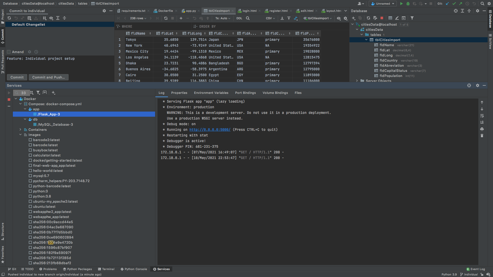
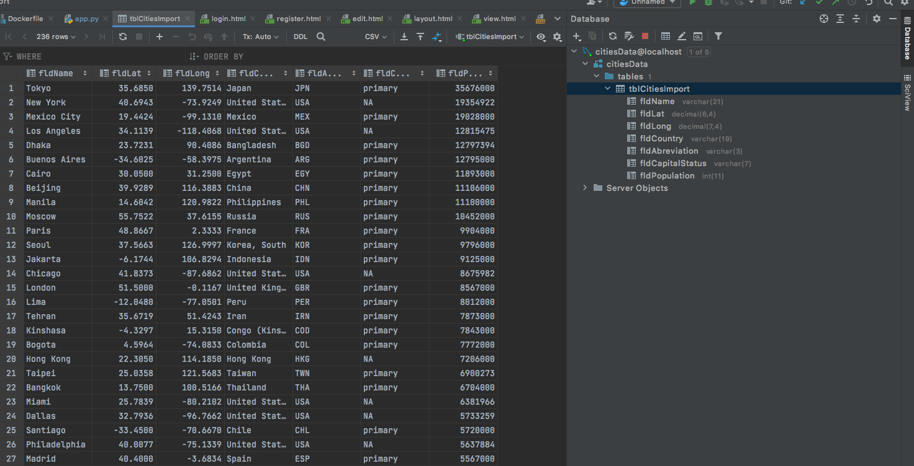
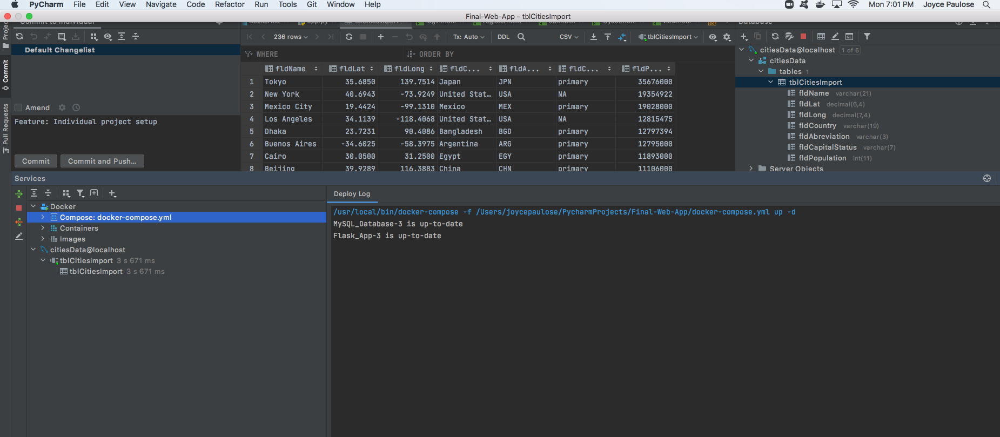
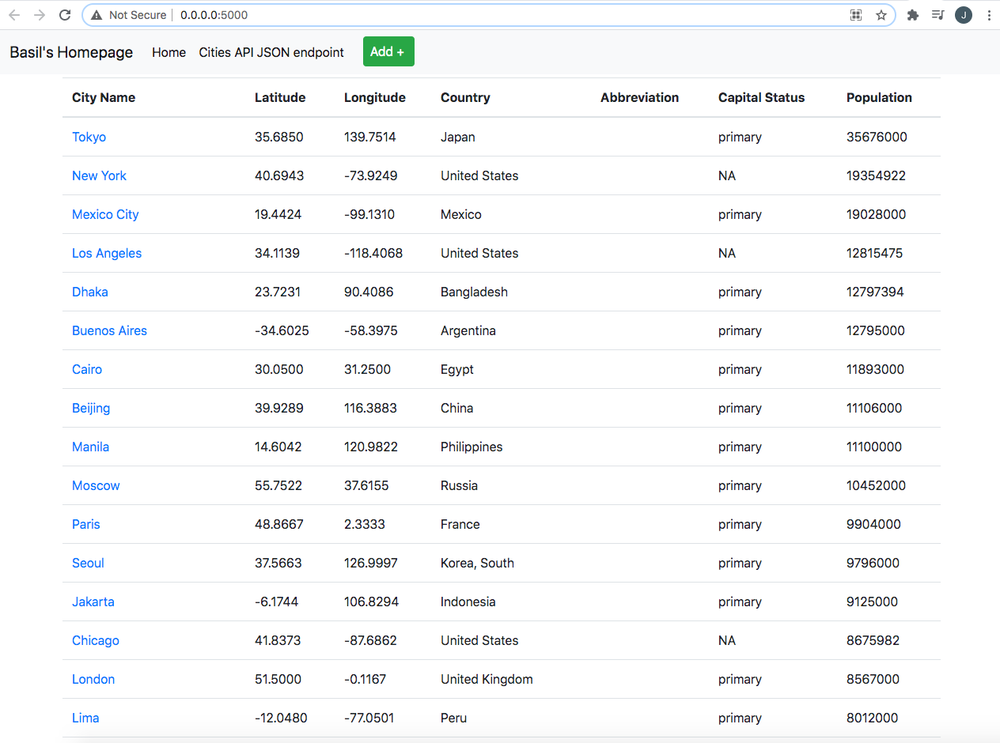
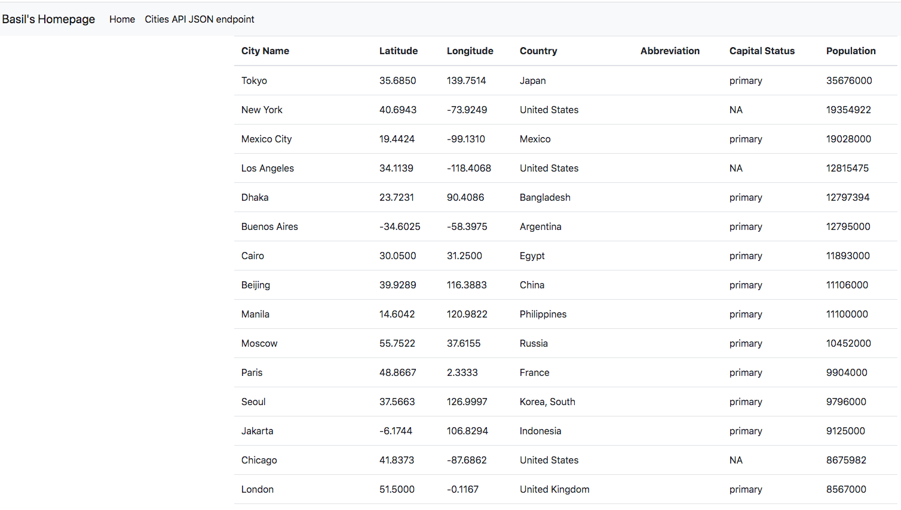
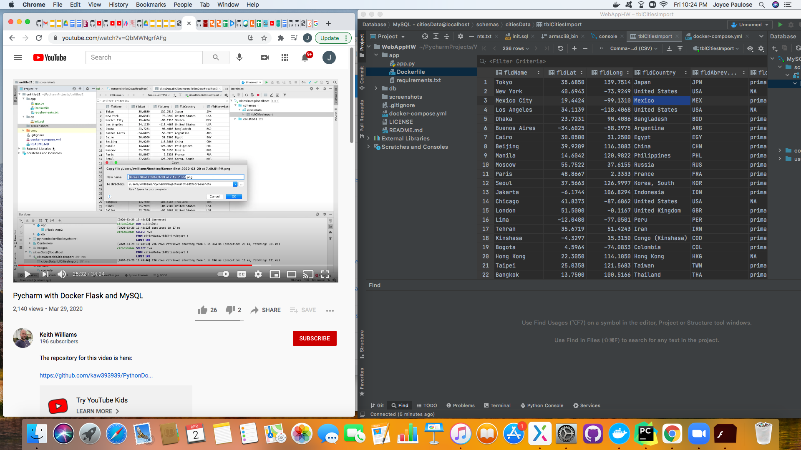
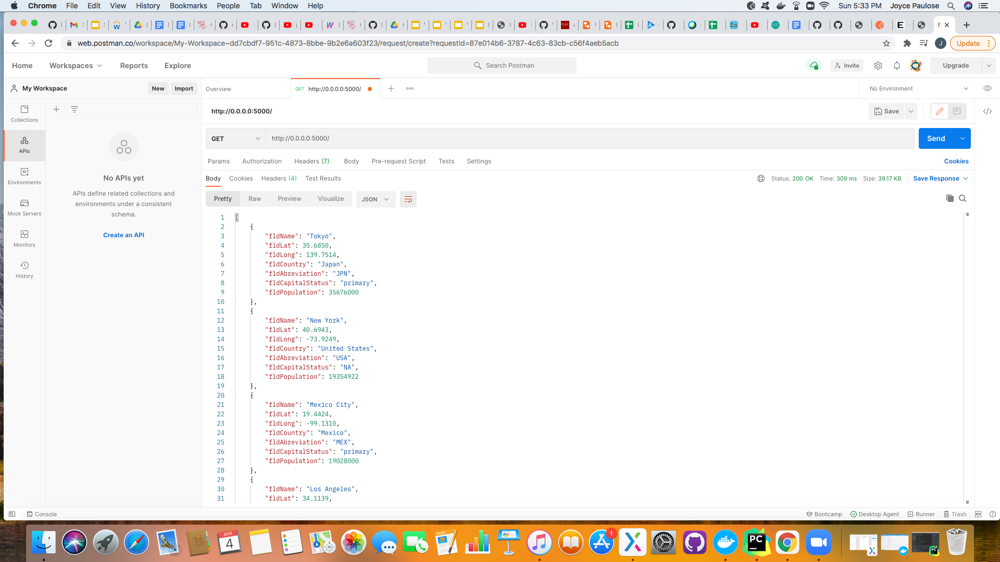

# Final-Web-App
After going through many different solutions, i decided to restart the entire application and the database was still not running on my docker. But after a little fiddling, I came up with a solution and fixed it by reinstalling pycharm and docker. But only the cities database is working on it. So I had to do all of it on this database. The Postman app will not work on my computer as well.

[Download Assignment PDF Here](PPFSQL-Homework.pdf)

[View Assignment Video Here](https://youtu.be/QbMWNgrfAFg)

# Project Part 4 Screenshot

# Project Part 3 Screenshot

# Project Part 2 Screenshot
 
# Project Query Screenshot
 
# Postman Screenshot

